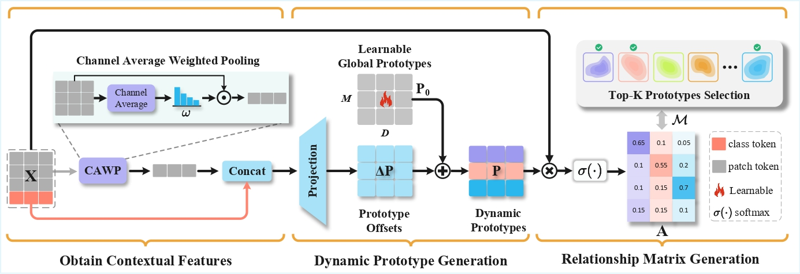
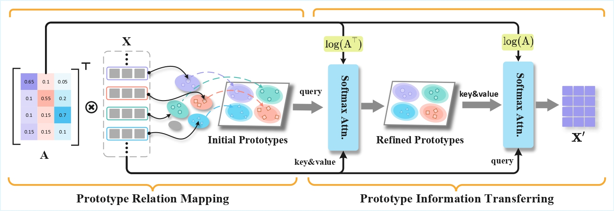
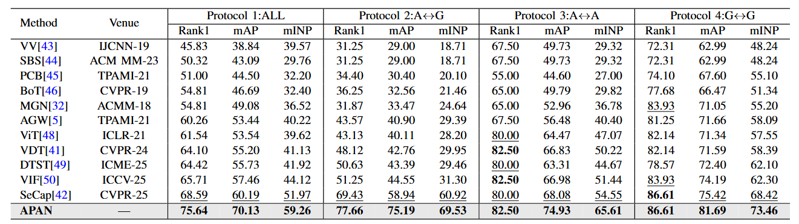
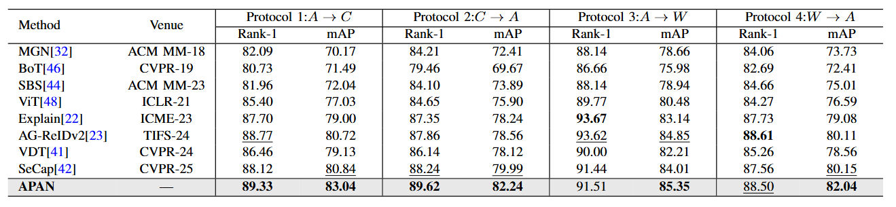
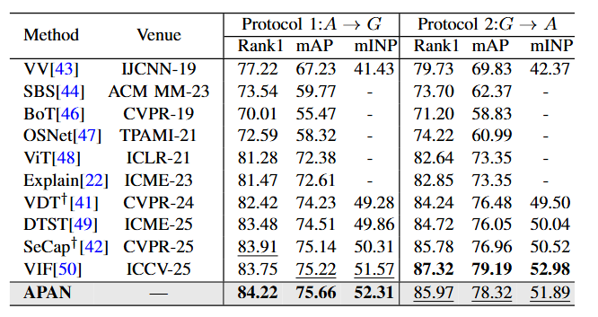

<h1 align="center">APAN: Adaptive Prototype-Aware Attention Network for Aerial-Ground Person Re-Identification</h1>
<h3 align="center">Xianxian Zeng, Yijun Chen, Jun Yuan, Jiawen Li, Rongjun Chen, Huimin Zhao, Jinchang Ren, Shun Liu*</h3>


## 📝 Abstract
Aerial-Ground Person Re-identification (AGPReID), which aims to match pedestrians across UAV and ground cameras, represents a critical multi-modal retrieval task at the intersection of vision and multimedia analysis. While effective in homogeneous settings, conventional person Re-identification (ReID) models falter under the extreme viewpoint and domain disparity inherent to AGPReID, rendering global features inadequate. Current methods seeking view-invariant representations still face difficulties in capturing robust local features, hampered by large intra-class variations and subtle inter-class differences. To address this, we propose an Adaptive Prototype-aware Attention Network (APAN) that learns view-invariant local features without auxiliary supervision. APAN operates through two synergistic modules: a Prototype Relation Modeling (PRM) module that establishes dynamic semantic centers and token-prototype associations, and a Prototype Information Flow Module (PIFM) that refines and propagates prototype-enhanced features in a closed loop. Furthermore, we introduce an Adaptive Distributional Margin Loss, which employs a mode-seeking mechanism to sharpen intra-class distributions and widen inter-class margins. Extensive experiments on three benchmarks validate that our approach achieves state-of-the-art performance.





## 🧠 Method

### 📦 Requirements
#### Step1: Prepare environments

Please refer to [INSTALL.md](./INSTALL.md).

#### Step2: Prepare datasets
- **CARGO:**   [Google Drive](https://drive.google.com/file/d/1yDjyH0VtW7efxP3vgQjIqTx2oafCB67t/view?usp=drive_link)
- **AGReID.v2:**  [Google Drive](https://drive.google.com/drive/folders/16r7G_CuUqfWG6_UCT7goIGRMqJird6vK?usp=share_link)
- **AGReID:**  [Google Drive](https://drive.google.com/file/d/1hzieEPlXfjkN3V3XWqI5rAwpF_sCF1K9/view?usp=sharing)

Download the datasets and modify the dataset path.  

#### Step3: Prepare ViT Pre-trained Models

Download the ViT-base Pre-trained model and modify the path in [configs](./configs/CARGO/apan.yml):

> PRETRAIN_PATH: xxx

### 🚀 Training & Testing


Use the following command to train APAN on the CARGO dataset. We use 4 GPUs for training; you can also train with a single GPU, but it will be much slower:

```bash
bash train_CARGO.sh
```


Use the following command to test APAN on the CARGO dataset:

```bash
bash test.sh
```


## 📊 Results

**Comparative retrieval performance on the CARGO dataset.** The highest and second-highest scores are formatted in bold and underlined text, respectively.


**Comparative retrieval performance on the AG-ReID.v2 dataset.** The highest and second-highest scores are formatted in bold and underlined text, respectively.


**Comparative retrieval performance on the AG-ReID dataset.** The highest and second-highest scores are formatted in bold and underlined text, respectively.



## 🙏 Acknowledgement
Codebase from [VDT](https://github.com/LinlyAC/VDT-AGPReID) and [SeCap](https://github.com/wangshining681/SeCap-AGPReID).
We sincerely thank the authors and contributors of these projects for their valuable contributions.

## 📖 Citation
If you find APAN useful in your research, please consider citing: